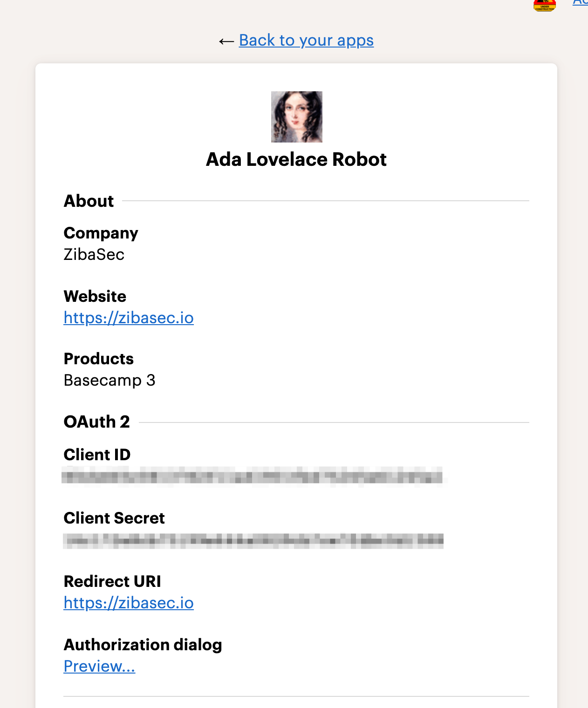

# Basecamp3 Token Broker

This is micro webservice that lets you request BC3 OAuth2 tokens on-demand.

This was built to facilitate easier automation with Basecamp via scripting, Zapier, etc.

Uses [Architect](https://arc.codes/) as the deployment framework.

## Getting Started

### Clone the repo

```bash
git clone git@github.com:zibasec/basecamp-token-broker.git
```

### Setup Basecamp3 Integration

1. You'll first want to configure a Basecamp 3 integration at https://launchpad.37signals.com/integrations
  1. Fill out the details with whatever you want
  1. Ensure that "Basecamp 3" is selected under Products
  1. Ensure that you specify a redirect URL that you can access. It does _not_ have to be a URL of an _actual_ app. At ZibaSec we just have it redirect to our homepage.
1. Note the values of 'Client ID' and 'Client Secret'
    

### Prep Deployment

1. Set environment variables for the Lambda function. Notice the usage of `staging` here. You'll want to also do this for `production` and _possibly_ for `testing` depending on your use-case. Also these should _not_ be stored in version control.
  * `npx arc env staging CLIENT_ID <your client id>`
  * `npx arc env staging CLIENT_SECRET <your client secret>`
  * `npx arc env staging BOT_EMAIL <the basecamp email address of your bot>`
  * `npx arc env staging BOT_PASSWORD <the bots basecamp password>` **Note:** Be sure to wrap your password in single-quotes if you have special characters
  * `npx arc env staging REDIRECT_URL <your redirect rule as you configured it in the basecamp integration>`

### Validate/Test

To validate your settings prior to deploying into your AWS account.
 In a separate terminal session, at the root of this repo

```bash
npx arc sandbox
```

You'll see something like

```text
         App ⌁ bc-token
      Region ⌁ us-east-1
     Profile ⌁ default
     Version ⌁ Architect 6.2.4
         cwd ⌁ /path/where/you/cloned

✓ Sandbox Found Architect manifest, starting up
✓ Startup Populating process.env with .arc-env @testing
✓ Sandbox Project files hydrated into functions
✓ Sandbox Loaded routes
    get / ................................. get-index

✓ Sandbox Started in 38ms
✈︎ Local environment ready!

    http://localhost:3333
```

Then attempt a request

```
curl localhost:3333
```

You should get back JSON that looks similar to:

```json
{"access_token":"BAhbB00000000000000000NjY4NzQzXSwidmVyc2lvbiI6MSwiYXBpX2RlYWRib2x0IjoiZWY5MTQ0Njg2NWZmYTcyNjQzYmZiYmJjMDhjYTk3YmIifQY6BkV0000000000NjY4NzQzXSuYW5vX251bWkCeQM6DW5hbm9fZ0000000000NjY4NzQzXSDoJem9uZUkiCFVUQwY7AEY=--13cdd2ab97c33fa9eeb6abd82c65e1b5f4ebddfc","expires_in":1209600,"refresh_token":"BAhbB0kiAbB7ImNsaWVudF9p0000000000NjY4NzQzXSjQ1ZTYxMjQ1YTEiLCJleHBpcmVzX2F0IjoiMjAzMC0wMy0yMFQx0000000000NjY4NzQzXSWzQxNjY4NzQzXSwidmVyc2lvbiI6MSwiYXBpX2RlYWRib2x0IjoiZWY5MTQ0Njg2NWZmYTc0000000000NjY4NzQzXShjYTk3Y0000000000NjY4NzQzXSk4ogwLarHU8JOg1uYW5vX251bWkB6DoNbmFub19kZW5pBjoNc3VibWlj0000000000NjY4NzQzXSBjsARg==--69fa11b4fa52401d72d8b41a94199e77bb6d9850"}
```

If that worked, you're ready to deploy.

### Deploy

**For staging**

```bash
npm run deploy
```

**For production**

```bash
npm run deploy:production
```

**Output**

You should get output that looks like:

```
         App ⌁ bc-token
      Region ⌁ us-east-1
     Profile ⌁ default
     Version ⌁ Architect 6.2.5
         cwd ⌁ /your/current/dir/

⚬ Deploy Initializing deployment
  | Stack ... BcTokenStaging
  | Bucket .. bc-token-cfn-deployments-8efe4
⚬ Hydrate Hydrating dependencies in 1 path
✓ Hydrate Hydrated src/http/get-index
  | npm ci: added 69 packages in 2.212s
✓ Success! Finished hydrating dependencies
⚬ Deploy Created deployment templates
✓ Deploy Generated CloudFormation deployment
✓ Deploy Deployed & built infrastructure
✓ Success! Deployed app in 43.692 seconds

    https://jdjdjdksksks.execute-api.us-east-1.amazonaws.com/staging

```

Take note of the URL, in this example `https://jdjdjdksksks.execute-api.us-east-1.amazonaws.com/staging`

#### Usage

When you deploy it into an AWS environment it will create an API key. You'll want to nab it from https://console.aws.amazon.com/apigateway/home?region=us-east-1#/api-keys/

Making a request looks like

`curl -H 'x-api-key: YOUR_GENERATED_API_KEY' https://jdjdjdksksks.execute-api.us-east-1.amazonaws.com/staging`

And this should return the same output as earlier when testing against the sandbox.

This means you can do things like:

1. Use Zapier to access the _entirety_ of the Basecamp3 API
1. Create scripts to manage your Basecamp3 environment
1. Do things against Basecamp 3 from your own web/network services

## Contributing

1. Make a GitHub issue to discuss
2. Do not use `git commit` instead use `npm run commit` which will make it easy to use our preferred commit message structure

## License

(Apache 2.0)[https://choosealicense.com/licenses/apache-2.0/]